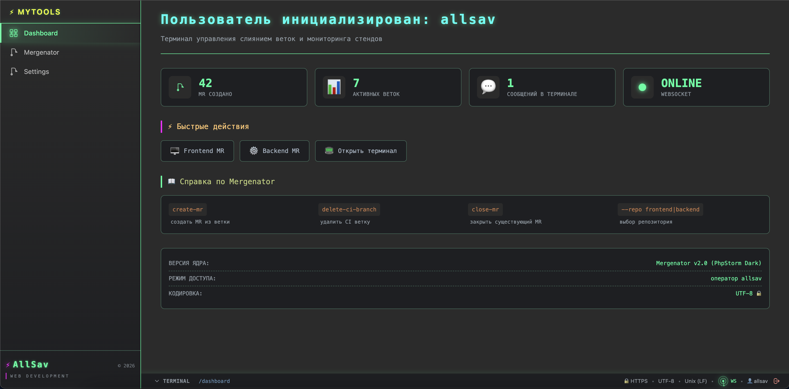
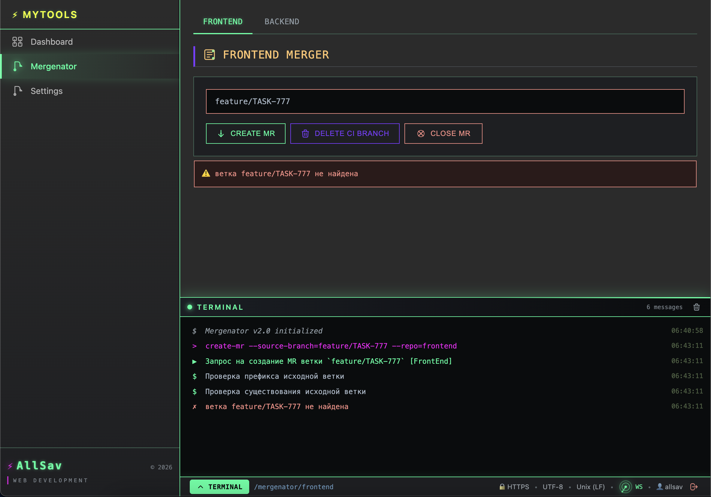

# MyTools

> - **Бэкенд**: [my-tools-backend](https://github.com/all-sav/my-tools-backend)
> - **Фронтенд**: [my-tools-frontend](https://github.com/all-sav/my-tools-frontend)

---

## Система мониторинга и управления стендом

Front: vue3 + vite

Back: go

> - Сейчас ведётяс активный рефакторинг бэкенда, разделение логики по разным пакетам и многое другое



### Мерженатор

Модуль для создания MR в инстансе gitlab используя API. 
Для специфических задач - когда надо выкладывать на стенд какую-то ветку но с какими-то дополнениями.

В веб-морде указываете ветку(которую предварительно запушили в репозиторий), дальше приложение само создаёт новую ветку от указанной,
мержит в неё ветку с дополнениями и создаёт MR в целевую ветку(например, в ветку на которой работает какой-нибудь сервер).

В гитлабе также можно настроить вебхук на адрес https://this-app-url/webhook/on-push чтобы он срабатывал на push в репозиторий.
Данное приложение отработает событие, автоматом подмержит изменения в ветку с дополнениями(созданную при создании MR). 



#### Конфиг nginx
```
server {
    listen 443 ssl;
    server_name my-domain.com;

    ssl_certificate /path-to-certs/fullchain.pem;
    ssl_certificate_key /path-to-certs/privkey.pem;

    ssl_protocols TLSv1.2 TLSv1.3;
    ssl_ciphers HIGH:!aNULL:!MD5;

    # Запрет индексации поисковиками
    add_header X-Robots-Tag "noindex, nofollow, nosnippet, noarchive" always;

    # Апишка бэкенда
    location /api {
        proxy_pass http://localhost:8085;
        proxy_set_header Host $host;
        proxy_set_header X-Real-IP $remote_addr;
    }

    # Websockets
    location /ws {
        proxy_pass http://localhost:8085;
        proxy_http_version 1.1;
        proxy_set_header Upgrade $http_upgrade;
        proxy_set_header Connection "upgrade";
        proxy_set_header Host $host;
    }

    # Todo: Фронтенд
    location / {
        
    }
}
```
